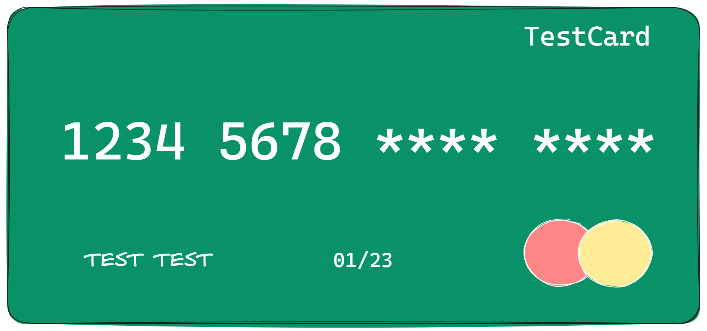

# data-masking

## Introduction

This project is a simple example to share and learn about data protection in a particular API.
In this case is data masking by using Spring Boot and a custom annotation @MaskData.



## Prerequisites

- Java 17 or higher
- Maven
- Postman (optional, for testing with the provided collection)

## How can I test it?

You import the following postman collection `doc/data_masking.postman_collection.json`. Or you can use the following
CURLs:

- **Get all users:**

```bash
curl --location 'http://localhost:8080/api/users'
```

- **Get user by ID:**

```bash
curl --location 'http://localhost:8080/api/users/1'
```

- **Save user:**

```bash
curl --location 'http://localhost:8080/api/users' \
--header 'Content-Type: application/json' \
--data '{
  "name": "Some name",
  "age": 24,
  "username": "sname",
  "password": "pass92d63c923ce",
  "phoneNumber": "2281561786"
}'
```